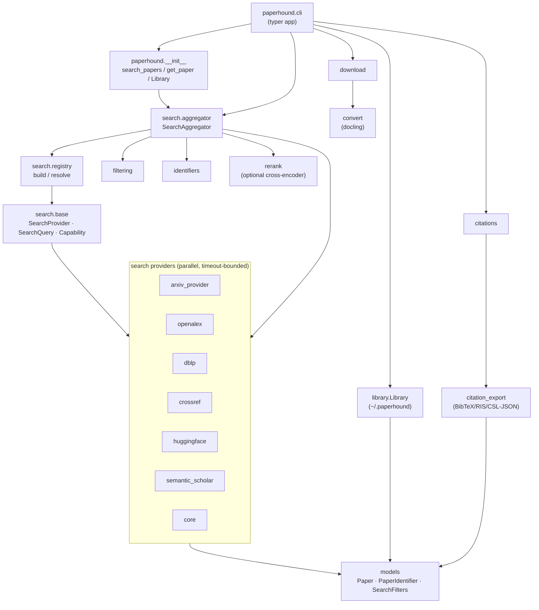

# 🛠️ Development

## Architecture

paperhound is a thin CLI on top of a library of small, composable modules.
The CLI (`paperhound.cli`) and the public helpers re-exported from
`paperhound/__init__.py` (`search_papers`, `get_paper`,
`convert_to_markdown`, `Library`) are the only user-facing surface — every
other module is a building block they wire together.

The data flow has three stages:

1. **Search / lookup.** The `SearchAggregator` fans a `SearchQuery` (or an
   identifier) out to every eligible `SearchProvider` in parallel under a
   global timeout, then round-robin-merges the per-provider results into
   a deduplicated `list[Paper]`. Identifier lookups go through
   `_merge_lookups`, which trusts the authoritative provider for the id
   kind (arXiv → `arxiv`, DOI → `crossref`/`openalex`, S2 → `semantic_scholar`)
   and drops non-authoritative records whose title disagrees — the
   metadata-poisoning guard.
2. **Download / convert.** `paperhound.download` resolves a `Paper` to a
   PDF URL and streams it to disk; `paperhound.convert` runs docling to
   turn the PDF into Markdown. Both are pure functions over `Paper` /
   path arguments — no provider state.
3. **Persist / export.** `paperhound.library.Library` owns the
   on-disk cache (`~/.paperhound/`), and `paperhound.citation_export`
   formats `Paper` records as BibTeX / RIS / CSL-JSON. `paperhound.rerank`
   is an optional cross-encoder pass over a result list.

Providers live under `paperhound.search.<provider>` and register
themselves through `paperhound.search.registry`. Each one implements
`SearchProvider` (`name`, `capabilities`, `available()`, `search()`,
`get()`) and declares its env vars via `ProviderEnvVar` so
`paperhound providers` can render setup hints. Adding a new source =
new module + registry entry; the aggregator picks it up automatically.

### Package layout

Four user-facing namespaces are packages with split-out internals so no
single file blows past a few hundred lines:

- `paperhound.cli` — `app` + helpers in `__init__.py`; one module per
  command group under `cli/_commands/` (`search`, `show`, `download`,
  `convert`, `get`, `library`, `citations`, `providers`); logging and
  help epilogs in `cli/_logging.py` and `cli/_help.py`.
- `paperhound.library` — public API in `__init__.py`; SQLite schema in
  `_schema.py`, dataclasses in `_models.py`, paths in `_paths.py`,
  pure-text helpers in `_keys.py`, the `Library` class in `_db.py`.
- `paperhound.citations` — `CitationBackend` ABC in `_base.py`,
  concrete backends in `_openalex.py` / `_semantic_scholar.py`, dedup
  in `_dedup.py`, BFS traversal + public `fetch_references` /
  `fetch_citations` in `_traversal.py`.
- `paperhound.citation_export` — shared formatting helpers in
  `_common.py`, one module per output format (`bibtex.py`, `ris.py`,
  `csl.py`), dispatcher in `__init__.py`.

Public import paths (`from paperhound.library import Library`,
`from paperhound.citations import fetch_references`, …) are unchanged.



## Setup

```bash
make install            # uv sync --extra dev
```

## Test & lint

```bash
make test               # unit tests (network-free, respx-mocked)
make test-integration   # live API tests — always live, no env-var gate
make test-all           # unit + integration
make check              # lint + format check + unit tests (run before pushing)
```

Unit tests use `respx` to mock HTTP, so they never touch the network.
Integration tests under `tests/integration/` always hit the real provider
APIs (arXiv, OpenAlex, DBLP, Crossref, Hugging Face Papers, Semantic
Scholar) — no env-var gate, no mocks. The `SemanticScholarProvider`
retries 429s with exponential backoff; export
`SEMANTIC_SCHOLAR_API_KEY` only if you want faster runs.

See [`docs/TESTING.md`](TESTING.md) for the standardized post-publish
smoke procedure.

## Releasing to PyPI

1. Bump `version` in `pyproject.toml`.
2. Push to `main`. The `Publish to PyPI` workflow builds and publishes
   via [PyPI Trusted Publishing](https://docs.pypi.org/trusted-publishers/) —
   idempotent on the version field, so re-pushing the same version is a
   no-op.

## Contribution workflow

The authoritative checklist for AI coding assistants and contributors
lives in [`CLAUDE.md`](../CLAUDE.md). Highlights:

- Every change ships through tests. No code lands without a unit test
  that would fail before the change and pass after.
- Live API calls live in `tests/integration/` only.
- Conventional Commits (`feat:`, `fix:`, `docs:`, `test:`, `chore:`).
- Patch bumps for bugfixes and additive features, minor bumps for
  breaking CLI changes.
